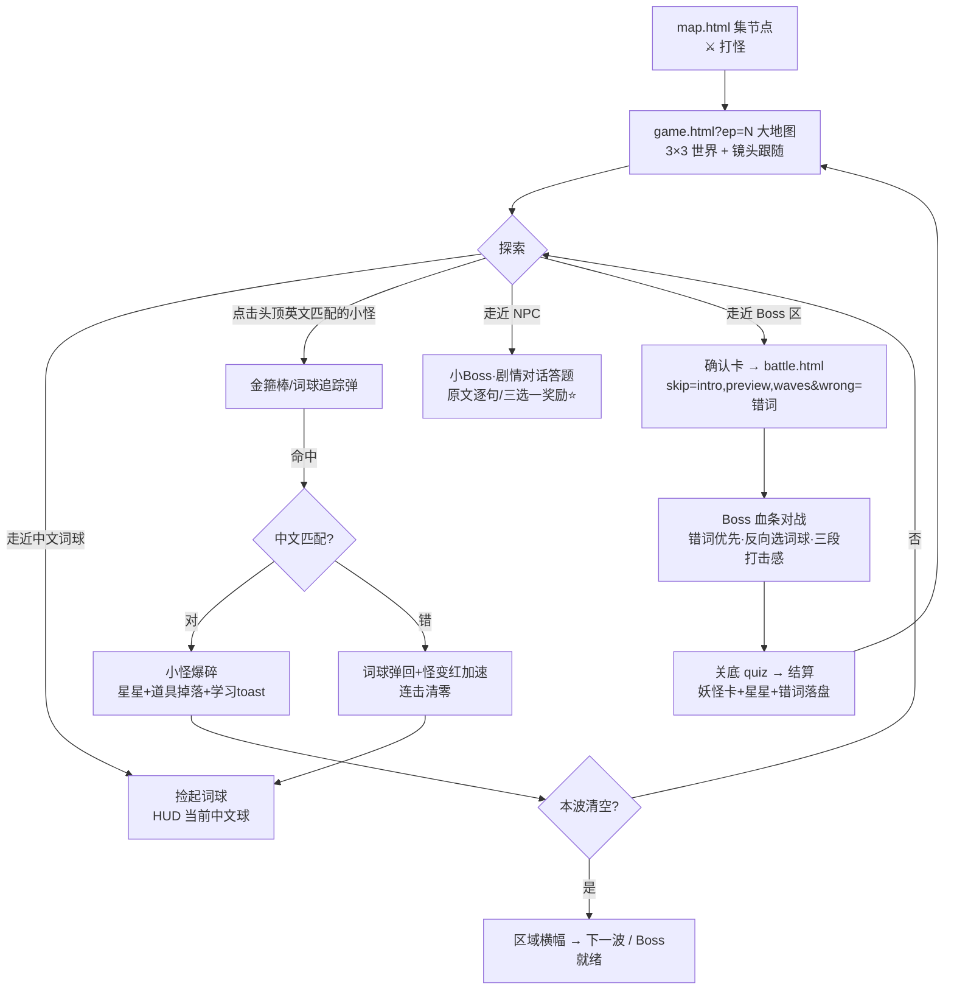
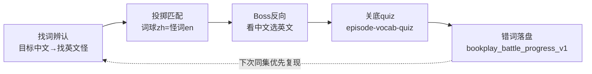
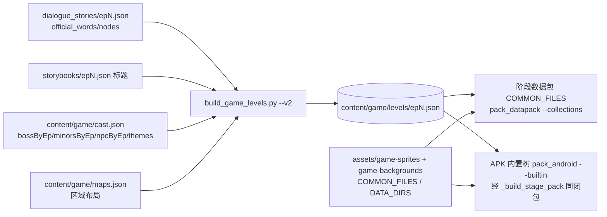
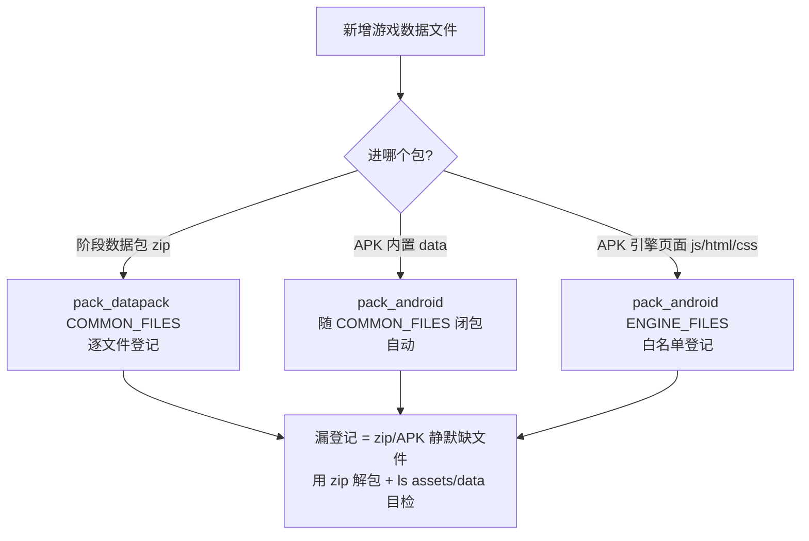

# 游戏流程架构

## 1. 玩法闭环（大地图三环节）

```mermaid
graph TD
  A[map.html 集节点<br/>⚔️ 打怪] --> B[game.html?ep=N 大地图<br/>3×3 世界 + 镜头跟随]
  B --> C{探索}
  C -->|走近中文词球| D[捡起词球<br/>HUD 当前中文球]
  C -->|点击头顶英文匹配的小怪| E[金箍棒/词球追踪弹]
  E -->|命中| F{中文匹配?}
  F -->|对| G[小怪爆碎<br/>星星+道具掉落+学习toast]
  F -->|错| H[词球弹回+怪变红加速<br/>连击清零]
  C -->|走近 NPC| I[小Boss·剧情对话答题<br/>原文逐句/三选一奖励⭐]
  G --> J{本波清空?}
  H --> D
  J -->|否| C
  J -->|是| K[区域横幅 → 下一波 / Boss就绪]
  C -->|走近 Boss 区| L[确认卡 → battle.html<br/>skip=intro,preview,waves&wrong=错词]
  L --> M[Boss 血条对战<br/>错词优先·反向选词球·三段打击感]
  M --> N[关底 quiz → 结算<br/>妖怪卡+星星+错词落盘]
  N --> B
```

## 2. 单词复习四遍闭环

```mermaid
graph LR
  A[找词辨认<br/>目标中文→找英文怪] --> B[投掷匹配<br/>词球zh=怪词en]
  B --> C[Boss反向<br/>看中文选英文]
  C --> D[关底quiz<br/>episode-vocab-quiz]
  D --> E[错词落盘<br/>bookplay_battle_progress_v1]
  E -.下次同集优先复现.-> A
```

## 3. 数据管道（构建期）

```mermaid
graph LR
  A[dialogue_stories/epN.json<br/>official_words/nodes] --> D[build_game_levels.py --v2]
  B[storybooks/epN.json 标题] --> D
  C[content/game/cast.json<br/>bossByEp/minorsByEp/npcByEp/themes] --> D
  C2[content/game/maps.json<br/>区域布局] --> D
  D --> E[(content/game/levels/epN.json)]
  E --> F[阶段数据包 COMMON_FILES<br/>pack_datapack --collections]
  E --> G[APK 内置树 pack_android --builtin<br/>经 _build_stage_pack 同闭包]
  H[assets/game-sprites + game-backgrounds<br/>COMMON_FILES / DATA_DIRS] --> F
  H --> G
```

## 4. 打包三白名单（新增数据必查）

```mermaid
graph TD
  Q[新增游戏数据文件] --> T{进哪个包?}
  T -->|阶段数据包 zip| A[pack_datapack COMMON_FILES<br/>逐文件登记]
  T -->|APK 内置 data| B[pack_android<br/>随 COMMON_FILES 闭包自动]
  T -->|APK 引擎页面 js/html/css| C[pack_android ENGINE_FILES<br/>白名单登记]
  A --> D[漏登记 = zip/APK 静默缺文件<br/>用 zip 解包 + ls assets/data 目检]
  B --> D
  C --> D
```
