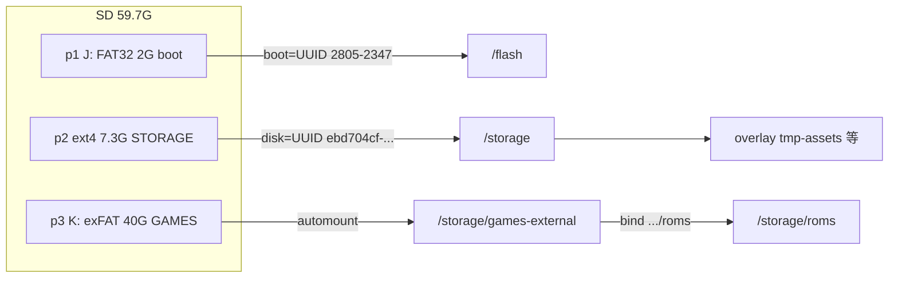

# 分区与挂载

```mermaid
flowchart LR
    subgraph card["SD 59.7G"]
      P1["p1 J: FAT32 2G boot"]
      P2["p2 ext4 7.3G STORAGE"]
      P3["p3 K: exFAT 40G GAMES"]
    end
    P1 -->|"boot=UUID 2805-2347"| Flash["/flash"]
    P2 -->|"disk=UUID ebd704cf-..."| Storage["/storage"]
    P3 -->|"automount"| Ext["/storage/games-external"]
    Ext -->|"bind .../roms"| Roms["/storage/roms"]
    Storage --> Ov["overlay tmp-assets 等"]
```

错误实验：把 P3 的 UUID 填进 `disk=`，Ov 立刻失败。
