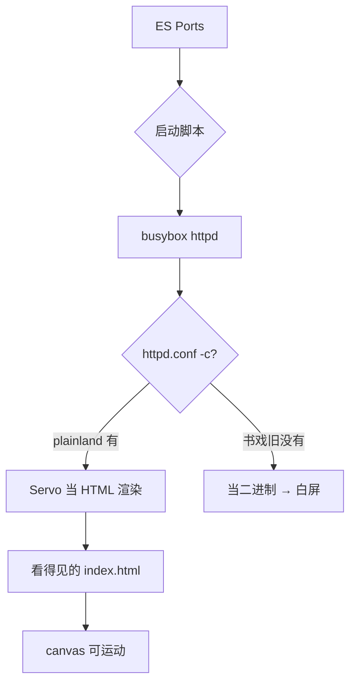

# 启动对照

```mermaid
flowchart TD
  es[ES Ports] --> sh{启动脚本}
  sh --> httpd[busybox httpd]
  httpd --> mime{httpd.conf -c?}
  mime -->|plainland 有| servoOK[Servo 当 HTML 渲染]
  mime -->|书戏旧没有| servoBin[当二进制 → 白屏]
  servoOK --> page[看得见的 index.html]
  page --> game[canvas 可运动]
```
