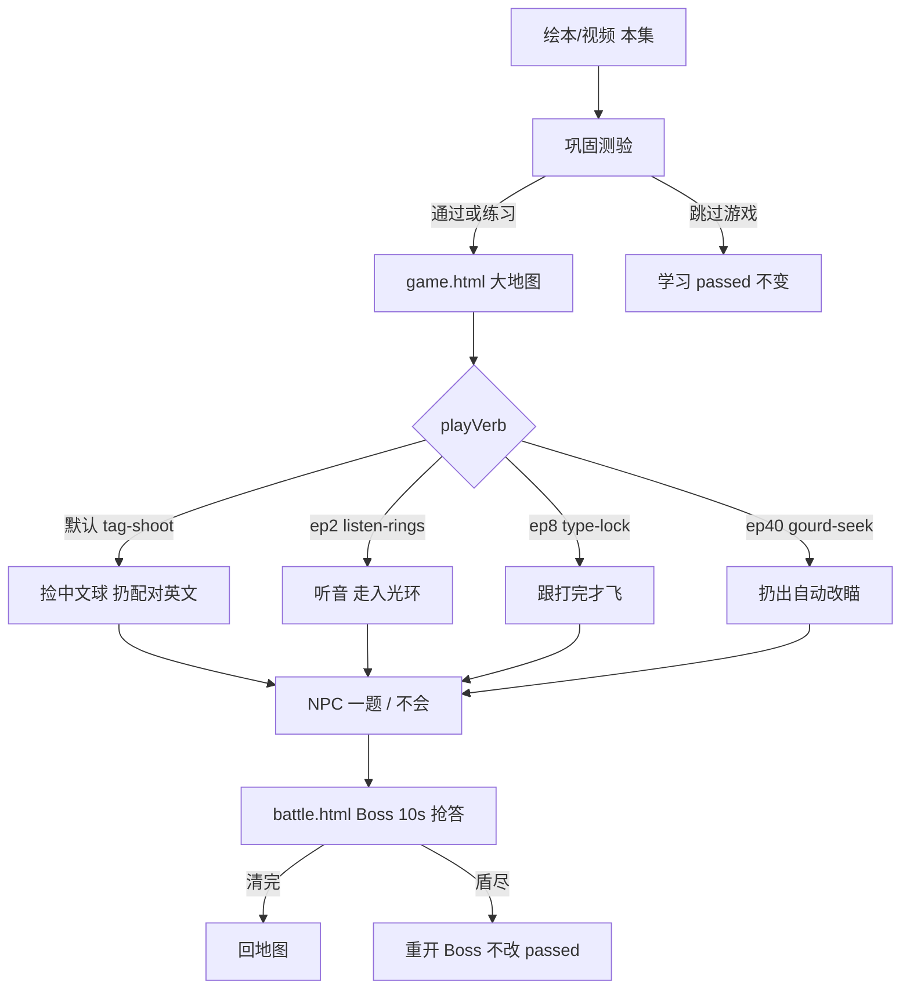
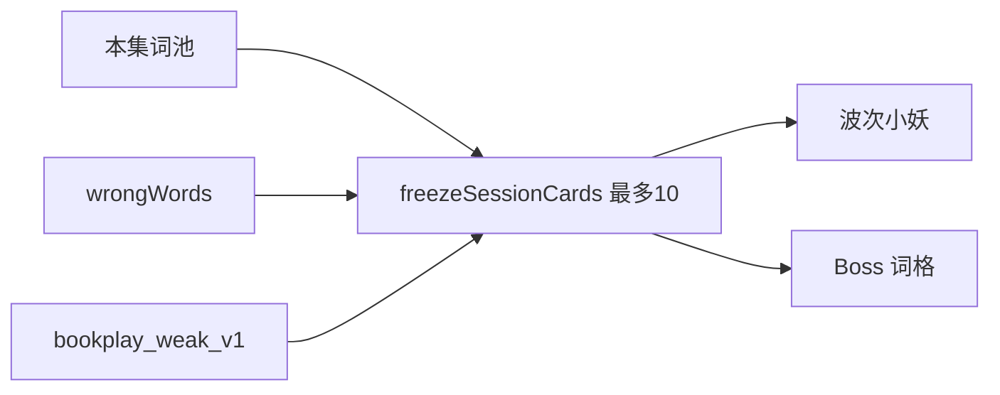

# 图解：整局与 playVerb

一句话：先学后玩；玩还是同一张图，只换这一集怎么出手。

```mermaid
flowchart TD
  book[绘本/视频 本集] --> drill[巩固测验]
  drill -->|通过或练习| map[game.html 大地图]
  drill -->|跳过游戏| done[学习 passed 不变]
  map --> verb{playVerb}
  verb -->|默认 tag-shoot| throw[捡中文球 扔配对英文]
  verb -->|ep2 listen-rings| ring[听音 走入光环]
  verb -->|ep8 type-lock| type[跟打完才飞]
  verb -->|ep40 gourd-seek| gourd[扔出自动改瞄]
  throw --> npc[NPC 一题 / 不会]
  ring --> npc
  type --> npc
  gourd --> npc
  npc --> boss[battle.html Boss 10s 抢答]
  boss -->|清完| back[回地图]
  boss -->|盾尽| retry[重开 Boss 不改 passed]
```

```mermaid
flowchart LR
  catalog[本集词池] --> freeze[freezeSessionCards 最多10]
  freeze --> waves[波次小妖]
  freeze --> hp[Boss 词格]
  wrong[wrongWords] --> freeze
  weak[bookplay_weak_v1] --> freeze
```
